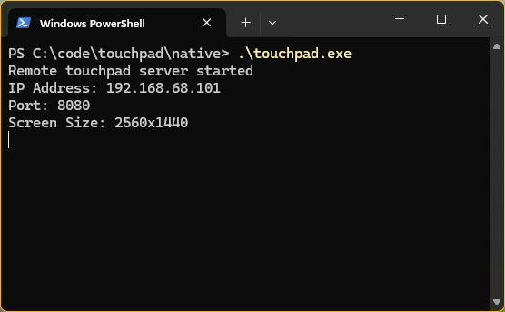
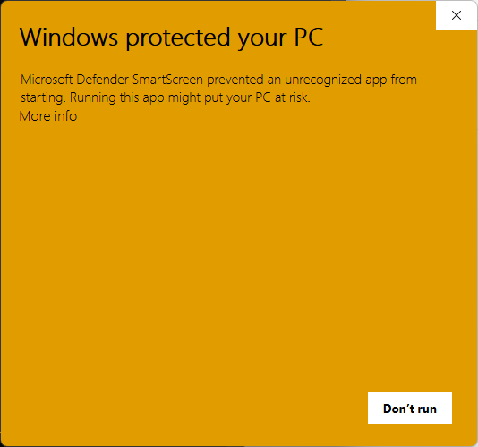
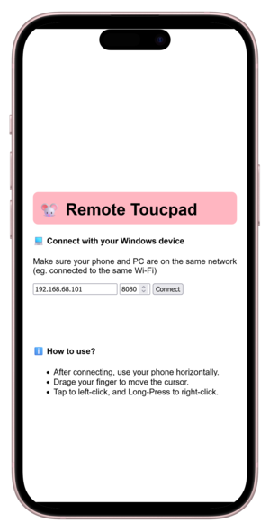

# Remote Touchpad

A Windows application that allows you to use your smartphone as a touchpad.
Supports left click and right click.

## How to use?

1. [Download the Windows app](https://github.com/agrawal-d/remote-touchpad/releases/latest) from "Releases" section on GitHub (`touchpad.exe`).
1. Run the windows app you downloaded and allow network access in any prompt if asked.

   

1. If SmartScreen blocks the app, click on "More info" and then click "Run anyway".

   

1. Note the IP Address and port shown ( see screenshot for example ).

1. Open the [website](http://agrawal-d.github.io/remote-touchpad) on your phone.
   Enter the IP address and port.

   

1. Enjoy using your phone as a touchpad!

## License

```
Remote Touchpad - A Windows application that allows you to use your smartphone as a touchpad.
Copyright (C) 2025 Divyanshu Agrawal <agrawal-d at outlook dot com>

This program is free software: you can redistribute it and/or modify
it under the terms of the GNU Affero General Public License as published
by the Free Software Foundation, either version 3 of the License, or
(at your option) any later version.

This program is distributed in the hope that it will be useful,
but WITHOUT ANY WARRANTY; without even the implied warranty of
MERCHANTABILITY or FITNESS FOR A PARTICULAR PURPOSE. See the
GNU Affero General Public License for more details.

You should have received a copy of the GNU Affero General Public License
along with this program. If not, see <https://www.gnu.org/licenses/>.
```
